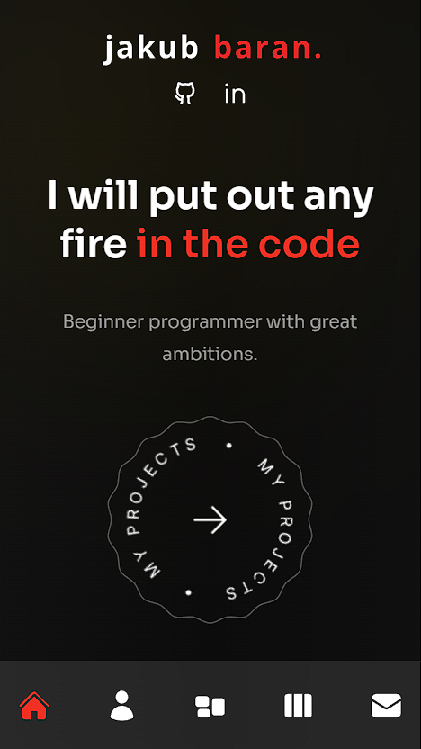
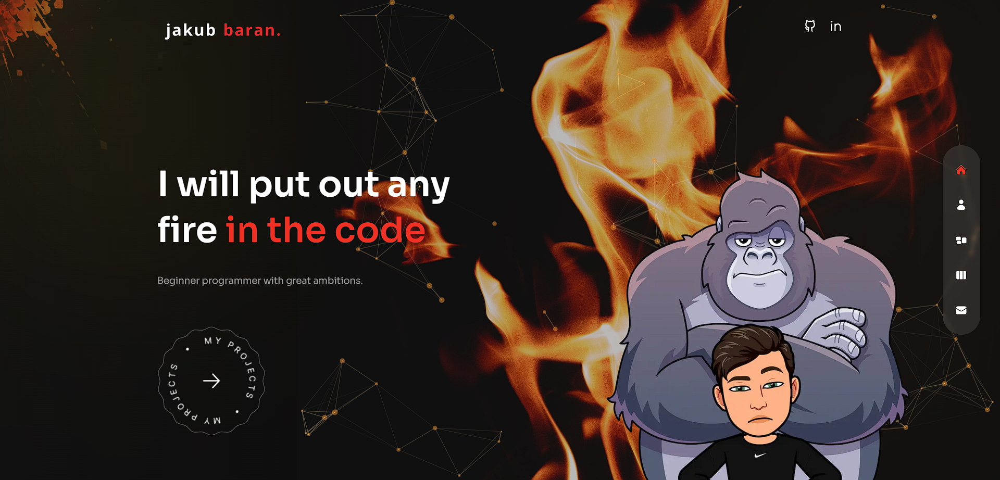

# Portfolio

This is my portfolio website.

## Technologies

| Technology          | Description                                                                                                    |
|---------------------|----------------------------------------------------------------------------------------------------------------|
| Next.js             | Next.js is a popular React framework for building server-side rendered (SSR) and static websites with ease.   |
| React               | React is a JavaScript library for building user interfaces, often used in combination with Next.js.           |
| Tailwind CSS        | Tailwind CSS is a utility-first CSS framework that helps create custom-styled components with minimal CSS.    |
| Framer Motion       | Framer Motion is a motion library for React that makes it easy to create smooth and interactive animations.   |
| React Icons         | React Icons provides a collection of popular icon libraries as React components, making it easy to use icons.  |
| React TSParticles   | React TSParticles is a React wrapper for tsParticles, a particle animation library for creating dynamic effects. |
| Swiper              | Swiper is a modern touch slider library for mobile-friendly, responsive carousels and sliders.                 |
| TypeScript          | TypeScript is a typed superset of JavaScript that adds static typing, improving code quality and development.  |

## Screenshots

## Installation and Setup

To run locally on your machine, follow these steps:

1. Clone the repository:

`git clone https://github.com/baranero/portfolio.git`

2. Install dependencies:

`cd portfolio`  
`npm install`

3. Run the development server:

`npm run dev`

4. The application will be accessible at `http://localhost:3000`.

## Available scripts

| Command        | Description                                                                                                    |
|---------------------|----------------------------------------------------------------------------------------------------------------|
| npm run dev            | Open local server   |
| npm run build           | Create optimized build           |
| npm run preview         | Run local server on build version          |

## Live demo

https://jakubbaran.dev
